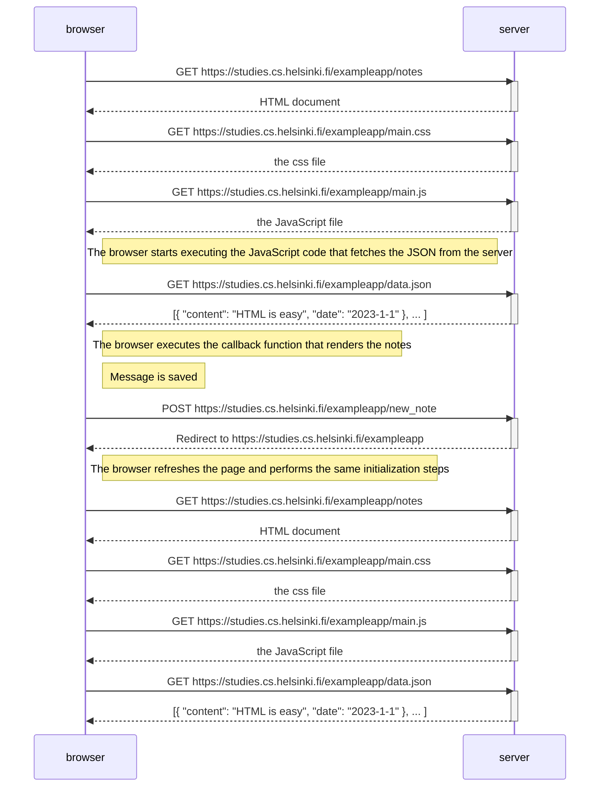

**Create a similar diagram** depicting the situation where the user creates a new note on the page [https://studies.cs.helsinki.fi/exampleapp/notes](https://studies.cs.helsinki.fi/exampleapp/notes) by writing something into the text field and clicking the _Save_ button.

If necessary, show operations on the browser or on the server as comments on the diagram.

The diagram does not have to be a sequence diagram. Any sensible way of presenting the events is fine.

All necessary information for doing this, and the next two exercises, can be found in the text of [this part](https://fullstackopen.com/en/part0/fundamentals_of_web_apps#forms-and-http-post). The idea of these exercises is to read the text once more and to think through what is going on there. Reading the application [code](https://github.com/mluukkai/example_app) is not necessary, but it is of course possible.

---

Actions:
1. Load the page
	- `GET` requests for HTML, CSS, JS, and JSON
2. Post Request
3. Reload page

