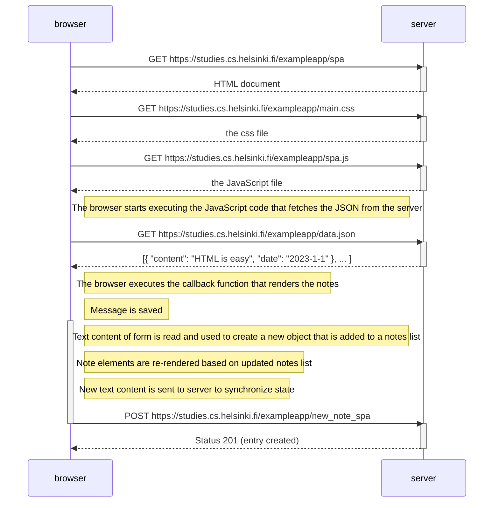

Create a diagram depicting the situation where the user creates a new note using the single-page version of the app.

---

In contrast to the basic notes site, we don't need to re-render all the content

